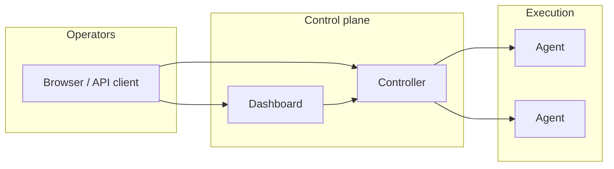
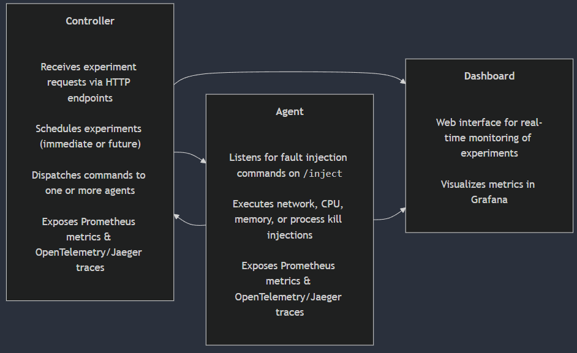

<h1 align="center">ChaosLabs</h1>

<p align="center">
  <a href="LICENSE"></a>
  <a href="https://go.dev/dl/"></a>
  <a href="https://nodejs.org/"></a>
</p>

<p align="center">
  
</p>
---

**ChaosLabs** is an open-source chaos engineering toolkit for distributed systems. Run controlled fault injection—network impairment, CPU and memory stress, process kills—and coordinate experiments across agents from a single controller, with a live dashboard and first-class observability hooks.

---

## Quick start

```bash
git clone https://github.com/fraware/chaoslabs.git
cd chaoslabs
docker compose up --build
```

| When things are up | URL / endpoint |
|-------------------|----------------|
| Dashboard | [http://localhost:3000](http://localhost:3000) (`npm run dev` or the `dashboard` service in Compose) |
| Controller API | `http://localhost:8080` (e.g. `POST /start`) |

Set `OTEL_EXPORTER_OTLP_ENDPOINT` if you run a local OpenTelemetry collector (see `infrastructure/compose/docker-compose.yml`, or the root `docker-compose.yml` wrapper).

**Run without Compose:** controller `cd controller && go run .` · agent `cd agent && go run .` · UI `cd dashboard-v2 && npm install && npm run dev`

---

## Run your first experiment

CPU stress for 15 seconds:

```bash
curl -X POST -H "Content-Type: application/json" -d '{
    "name": "CPU Stress Test",
    "description": "Runs CPU stress with 4 workers for 15s",
    "experiment_type": "cpu-stress",
    "duration": 15,
    "cpu_workers": 4
}' http://localhost:8080/start
```

| Experiment | `experiment_type` | Typical parameters |
|------------|-------------------|--------------------|
| Network latency | `network-latency` | `delay_ms` |
| Packet loss | `network-loss` | `loss_percent` |
| Memory stress | `mem-stress` | `mem_size_mb` |
| Process kill | `process-kill` | `kill_process` |

Use `start_time` (RFC3339) to schedule, or `"parallel": true` with `agent_count` for multi-agent runs. Step-by-step guides: [docs/TUTORIAL.md](docs/TUTORIAL.md).

---

## What ships in this repo

| Piece | Responsibility |
|-------|----------------|
| **Controller** | HTTP API for experiments, scheduling, dispatch to agents; Prometheus metrics; **OpenTelemetry** traces via **OTLP/HTTP**. |
| **Agent** | Executes faults (`tc`, `stress-ng`, process signals) on `/inject`; metrics and OTLP tracing (same env vars as the controller). |
| **Dashboard** | Real-time experiment monitoring and Grafana-oriented workflows. |
| **CLI** | Export signing, verification, and related tooling ([cli/README.md](cli/README.md)). |

---

## Architecture


```mermaid
flowchart LR
  subgraph operators [Operators]
    U[Browser / API client]
  end
  subgraph control [Control plane]
    D[Dashboard]
    C[Controller]
  end
  subgraph data [Execution]
    A1[Agent]
    A2[Agent]
  end
  U --> D
  U --> C
  D --> C
  C --> A1
  C --> A2
```

<p align="center">
  
</p>

Deeper detail: [docs/ARCHITECTURE.md](docs/ARCHITECTURE.md) · Kubernetes: [docs/KUBERNETES.md](docs/KUBERNETES.md) · manifests: `infrastructure/k8s/`

---

## Features

- **Fault injection** — Network latency and loss, CPU and memory stress, targeted process termination.
- **Scheduling and scale** — Deferred starts and parallel execution across multiple agents.
- **Observability** — Prometheus `/metrics`, optional Grafana dashboards, OTLP-compatible tracing (`OTEL_EXPORTER_OTLP_ENDPOINT`).
- **Deployment options** — Docker Compose for local stacks; Kubernetes for production-style runs.

---

## Prerequisites

- [Docker](https://docs.docker.com/get-docker/) and [Docker Compose](https://docs.docker.com/compose/install/)
- [Go](https://go.dev/dl/) 1.23+ (toolchain aligned with `go.work` / modules)
- [Node.js](https://nodejs.org/) 20+ and npm for `dashboard-v2`
- Optional: Kubernetes, Prometheus, Grafana, and an OTLP-capable collector or backend

---

## Observability and monitoring

- **Metrics** — Controller and agent expose Prometheus endpoints; K8s manifests include scrape annotations.
- **Dashboards** — Import bundled Grafana JSON for experiment counts, durations, agent health, and utilization.
- **Tracing** — OTLP/HTTP export; point `OTEL_EXPORTER_OTLP_ENDPOINT` at a collector, Jaeger (OTLP), Tempo, or similar.

Configuration reference: [controller/HTTP_CONFIGURATION.md](controller/HTTP_CONFIGURATION.md)

---

## Documentation

| Resource | Description |
|----------|-------------|
| [docs/README.md](docs/README.md) | Central index: API OpenAPI, Windows setup, event bus, troubleshooting |
| [docs/TUTORIAL.md](docs/TUTORIAL.md) | Guided experiments |
| [docs/TROUBLESHOOTING.md](docs/TROUBLESHOOTING.md) | Ports, tracing, faults, metrics |
| [docs/CONTRIBUTING.md](docs/CONTRIBUTING.md) | How to contribute |

---

## Troubleshooting (short list)

- **Images not pulling** — Confirm registry tags and pull secrets.
- **Faults not applying** — Many injectors need root or privileged containers on the agent.
- **Missing metrics** — Check Prometheus annotations and scrape config.
- **Tracing** — Validate `OTEL_EXPORTER_OTLP_ENDPOINT` and optional `OTEL_HEALTHCHECK_URL`.

Full runbook: [docs/TROUBLESHOOTING.md](docs/TROUBLESHOOTING.md)

---

## FAQ

**Do I need elevated privileges?**  
Yes for several techniques (`tc netem`, `stress-ng`, and similar). Run the agent with sufficient capabilities or as root where your environment allows it.

**Can I run everything on one machine?**  
Yes. Docker Compose is the fastest path; you can also run controller, agent, and dashboard processes separately.

**How do I add or change fault types?**  
See [docs/CONTRIBUTING.md](docs/CONTRIBUTING.md).

**Windows development?**  
See [docs/windows-setup.md](docs/windows-setup.md).

---

## Contributing

Contributions are welcome. Read [docs/CONTRIBUTING.md](docs/CONTRIBUTING.md) and, when you can, run `make verify` from the repository root (or `.\scripts\check-all.ps1` on Windows).

---

## License

ChaosLabs is released under the [MIT License](LICENSE).
