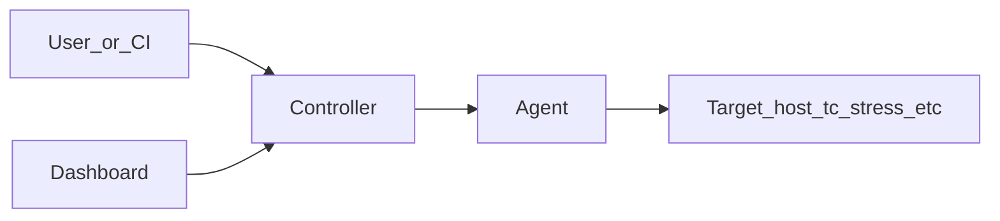

# ChaosLabs architecture

ChaosLabs is a small distributed system for running controlled fault-injection experiments.

## Components

| Component | Role |
|---------|------|
| **Controller** | HTTP API (`/start`, `/stop`, `/experiments`, health, Prometheus `/metrics`). Schedules work and talks to agents. |
| **Agent** | Runs on target hosts; exposes `/inject` and `/metrics`; executes experiments (network, stress, process kill). |
| **Dashboard** | Vite + React UI in `dashboard-v2`; talks to the controller API (often via dev proxy). |
| **CLI** | `cli/` — Cobra-based command-line helper. |

## Request flow

## Observability

- **Metrics:** Prometheus client libraries on controller and agent.
- **Traces:** OpenTelemetry with **OTLP/HTTP** export (`OTEL_EXPORTER_OTLP_ENDPOINT`). Legacy Jaeger HTTP collector endpoints are no longer used.
- **Logs:** Controller uses structured **slog** (JSON) and attaches `X-Request-Id` per HTTP request.

## Repository layout

- Go modules: `controller`, `agent`, `cli`, `bench`, `agent/cmd/doctor`, `tests/integration`.
- Workspace file: `go.work` at the repository root (no root `go.mod`).
- Local stacks: `infrastructure/compose/docker-compose.yml` (minimal); root `docker-compose.yml` includes that file for convenience.
- CI: `.github/workflows/ci-optimized.yml` (path filters, lint, tests, integration, images, k6 smoke).
- API contract: `docs/api/openapi.yaml` (hand-maintained; keep in sync with handlers).

## Kubernetes

Example manifests live under `infrastructure/k8s/`. The controller runs as non-root (distroless); the agent remains privileged where required for network and cgroup manipulation. Adjust `OTEL_EXPORTER_OTLP_ENDPOINT` to your collector service DNS name.

## Further reading

- [README.md](README.md) — documentation index
- [KUBERNETES.md](KUBERNETES.md) — cluster deployment
- [api/openapi.yaml](api/openapi.yaml) — HTTP API contract
- [../controller/HTTP_CONFIGURATION.md](../controller/HTTP_CONFIGURATION.md) — controller HTTP options
- [EVENT_BUS_IMPLEMENTATION.md](EVENT_BUS_IMPLEMENTATION.md) — NATS event bus (advanced)
